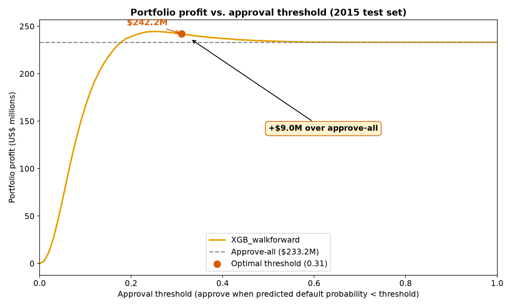
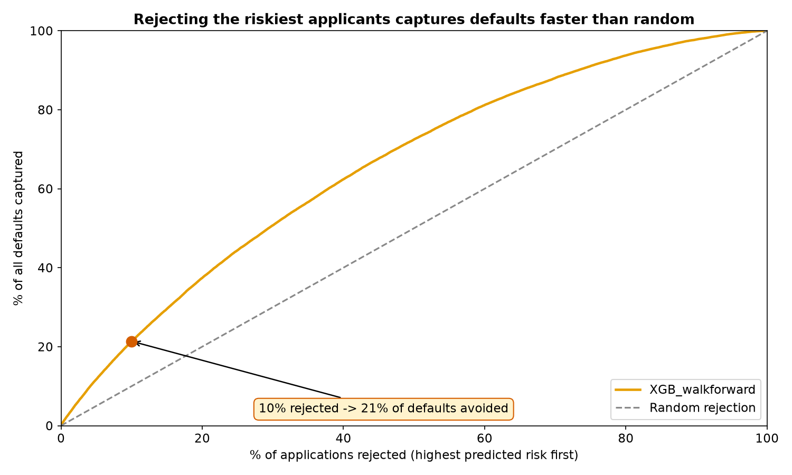
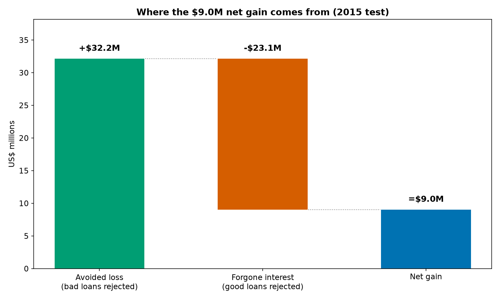
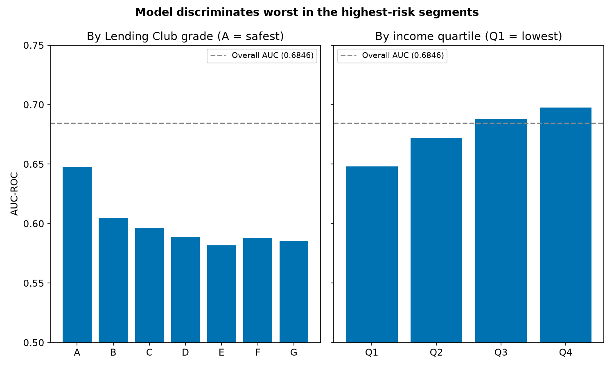

# Credit Default Prediction — Lending Club

Turning loan approvals into a profit decision: a credit-default model for real
peer-to-peer consumer loans, selected and evaluated by expected portfolio profit — not
accuracy.



## Headline Result

**On the 2015 held-out test set, the model rejects 3.8% of loan applications — avoiding
$32.2M in losses at the cost of $23.1M in forgone interest — a net gain of $9.0M over an
approve-everyone policy** (95% CI $7.6M–$10.7M). Over a logistic-regression baseline, the
gain is +$6.3M. The total portfolio profit under the model's policy is $242.23M; that
figure already includes the $233.2M an approve-all policy would produce with no modeling
effort — the model's own attributable contribution is the $9.0M delta, not the gross
total.

**Key insight**: the model was chosen by expected profit, not accuracy — and this
mattered. The winning model ties a simpler logistic-regression baseline on AUC (0.68) but
wins decisively on profit. A standard accuracy/AUC contest would have called these two
models a coin flip and missed $6.3M of real, measurable value.

Rejecting just the riskiest 10% of applicants avoids ~21% of all defaults — twice as
effective as a random cut of the same size. Trained and evaluated on ~673K matured
36-month Lending Club loans (2007–2015, 14.8% default rate).

**Honest caveat, stated up front, not buried**: the model is least reliable in the
highest-risk, lowest-income segment; it was trained only on approved loans, so it cannot
score rejected applicants (a selection-bias limit); and it is not built for live lending
decisions as-is.

## Key Results

| Model | Test profit (2015) | 95% CI |
|---|---|---|
| Approve-all baseline | $233.2M | — |
| Logistic-regression baseline | $235.9M | — |
| **XGBoost, walk-forward-tuned (this model)** | **$242.2M** | **[$237.9M, $246.7M]** |

Rejecting the riskiest applicants captures defaults far faster than a random cut, and the
$9.0M net gain decomposes cleanly into avoided losses minus forgone interest — the number
is not inflated by an aggressive rejection policy (96.2% of applications are still
approved):





## Methodology, in Brief

- **Decision metric is expected portfolio profit**, not accuracy: `profit = interest on
  approved good loans − lost principal on approved bad loans`. A bad loan costs 2.67x
  what a good loan returns at the median — treating every error equally, as accuracy
  does, misrepresents the actual economics of the decision.
- **Validation is temporal / walk-forward, never random**: train ≤2013, validate 2014,
  test 2015. Hyperparameters were selected across three expanding time windows
  (2011→2012, 2012→2013, 2013→2014), optimizing profit in each window — not a single
  validation year, and not AUC.
- **Missing data was resolved by mechanism**, not blanket imputation: informative
  absence (MNAR), staged bureau-data rollouts, and sparse-but-informative nulls each got
  a different, evidence-based treatment.
- **Leakage was screened on three fronts**: temporal (never shuffled), target
  (post-origination columns dropped, confirmed by univariate AUC), and identity
  (borrower ID is 100% null — group-level splitting is not possible, and this is stated
  as a limitation, not hidden).
- **Two engineered features were tried and dropped** (redundant FICO average; a
  bankcard-utilization ratio undefined for 30% of borrowers) — reported as a strength of
  the process, not omitted.
- **Calibration was checked, and a recalibration attempt was rejected**: it improved a
  reliability metric but cost 42% of training data for no net profit gain.

Full methodology and every underlying number: [`docs/technical_report.md`](docs/technical_report.md).

## Limitations

The model is not uniformly reliable, and that is reported directly rather than
smoothed over in an aggregate metric:



- **Weakest exactly where risk is highest**: AUC falls from 0.648 (grade A) to 0.585
  (grade G), and from 0.697 (highest income quartile) to 0.648 (lowest) — the reverse of
  where a lender would most want precision.
- **Selection bias**: the model estimates P(default | approved), having never seen a
  rejected application. It cannot say how it would perform as a first-pass underwriting
  filter, only as a second layer over an already-approved loan book.
- **Not transferable to 60-month loans** without a dedicated scorecard — applied without
  refitting, performance degrades severely, evidence that 36- and 60-month loans are
  structurally distinct risk populations.
- **Not deployed.** Packaged as a reproducible, serialized artifact — no API, no live
  monitoring, no drift detection. Deployment and a separate 60-month scorecard are named
  next steps, not gaps.

Full disaggregated results, calibration analysis, and SHAP explainability:
[`docs/technical_report.md`](docs/technical_report.md) §8.

## The Model

XGBoost wrapped for interface consistency alongside a scikit-learn `Pipeline` logistic
baseline. 79 named features, expanding to 90 columns after one-hot encoding. Serialized
with `joblib` at `models/xgb_final.joblib`; hyperparameters, feature list, and a SHA256 of
the exact training data are recorded in `models/model_meta.json`. Reproducible end to end
via `python run_all.py` (~3 minutes, CPU only). Bit-exact determinism requires three
conditions: `random_state=42`, `n_jobs=1`, and training rows kept in their original
on-disk order (XGBoost's histogram algorithm is not row-order invariant).

Full specification: [`docs/MODEL_CARD.md`](docs/MODEL_CARD.md).

## Reproducing This Project

```bash
git clone https://github.com/MateusFPavan/credit-default-prediction-lendingclub.git
cd credit-default-prediction-lendingclub
python -m venv .venv
source .venv/bin/activate          # Windows: .venv\Scripts\Activate.ps1
pip install -r requirements.txt
# register the Jupyter kernel used by the pipeline notebooks — see docs/SETUP.md
```

Download the raw dataset manually (Kaggle `wordsforthewise/lending-club`, CC0 license —
requires a free Kaggle account, not auto-downloaded) and place it at
`data/raw/accepted_2007_to_2018Q4.csv`. Then:

```bash
python run_all.py
```

This reproduces the final model and its exact test result — raw CSV → cleaned dataset →
temporal split → features → trained model → verified profit — in about 3 minutes on CPU.
**It deliberately does not re-run the model-*selection* experiments** (baseline
comparison, walk-forward hyperparameter tuning, bootstrap validation — `notebooks/06`–
`11`): those take hours and are not needed to reproduce the delivered model. They are
fully documented, not hidden — see `docs/FACTS.md` and the notebooks themselves.

Full setup and troubleshooting: [`docs/SETUP.md`](docs/SETUP.md).

## Repository Structure

```
data/            raw CSV (gitignored) and processed parquets (gitignored, sample versioned)
notebooks/       01-15 working notebooks (full process) + 1.0-7.0 narrated notebooks (presentation)
src/             data.py, features.py, economics.py, models.py, verify_pipeline.py
models/          xgb_final.joblib, logistic_baseline.joblib (gitignored); model_meta.json (versioned)
reports/figures/ business-impact figures
docs/            technical report, data card, model card, setup guide, facts sheet
references/      one-page recruiter case studies (EN and pt-BR)
```

## Documentation Index

| Document | Purpose |
|---|---|
| [`docs/technical_report.md`](docs/technical_report.md) | Full methodology and results |
| [`docs/FACTS.md`](docs/FACTS.md) | Canonical, verified facts sheet — single source of truth for every number |
| [`docs/DATA_CARD.md`](docs/DATA_CARD.md) | Dataset datasheet (provenance, license, missing-data mechanisms) |
| [`docs/MODEL_CARD.md`](docs/MODEL_CARD.md) | Model specification, training procedure, evaluation |
| [`docs/SETUP.md`](docs/SETUP.md) | Environment setup and reproduction, step by step |
| [`references/one_pager.md`](references/one_pager.md) | One-page recruiter case study (EN) |
| [`references/one_pager.pt-br.md`](references/one_pager.pt-br.md) | One-page recruiter case study (pt-BR) |
| `notebooks/` | Full working process (`01`–`15`) and a narrated walkthrough (`1.0`–`7.0`) |

## Stack

Python · pandas · scikit-learn · XGBoost · SHAP · matplotlib

## License & Contact

MIT — see [`LICENSE`](LICENSE). **Author**: Mateus Fardin Pavan. **Repository**:
<https://github.com/MateusFPavan/credit-default-prediction-lendingclub>. **Contact**:
<https://www.linkedin.com/in/mateus-fardin-pavan/>.
