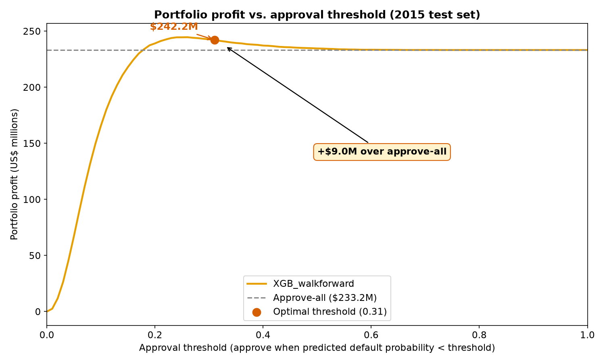
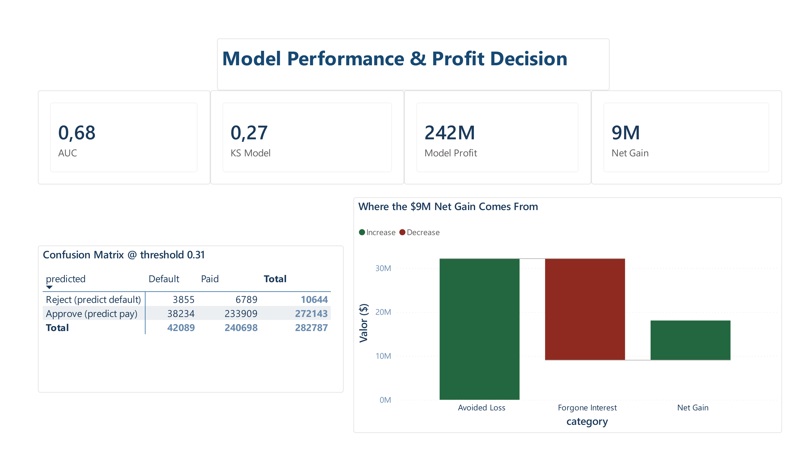
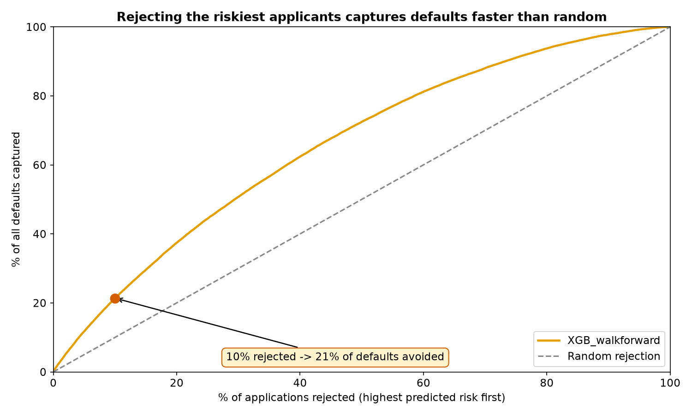
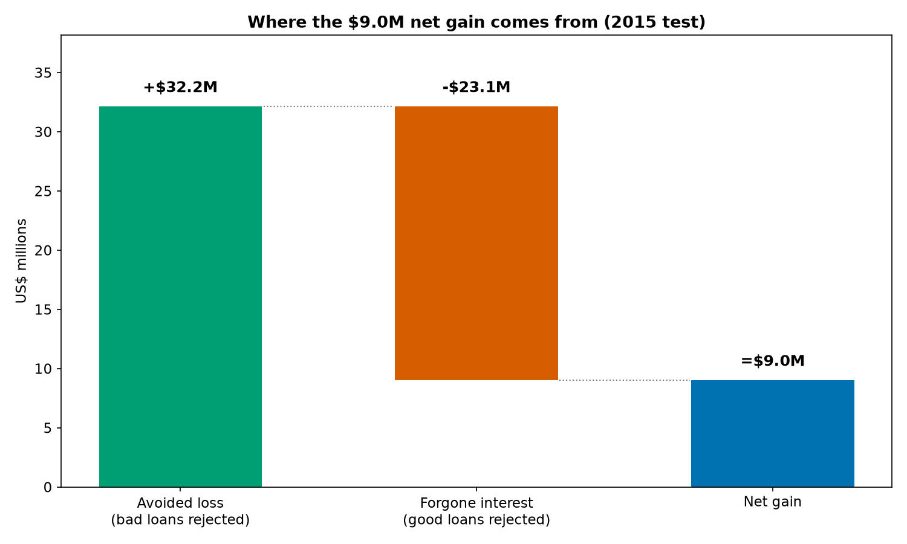
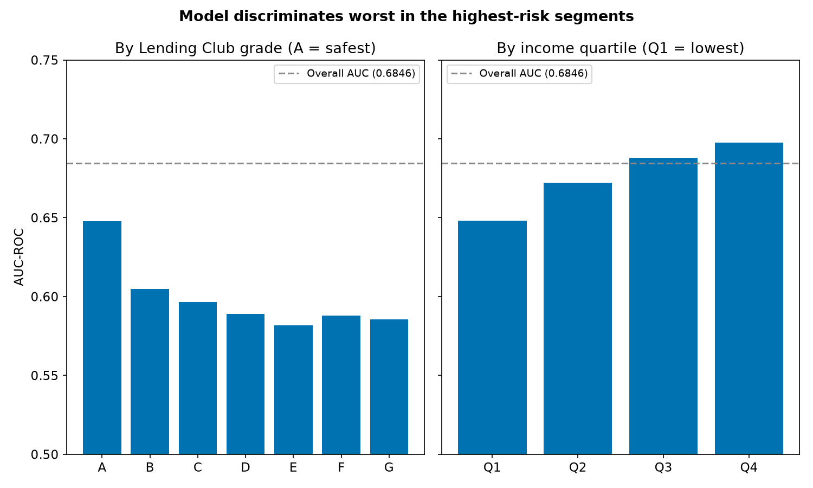
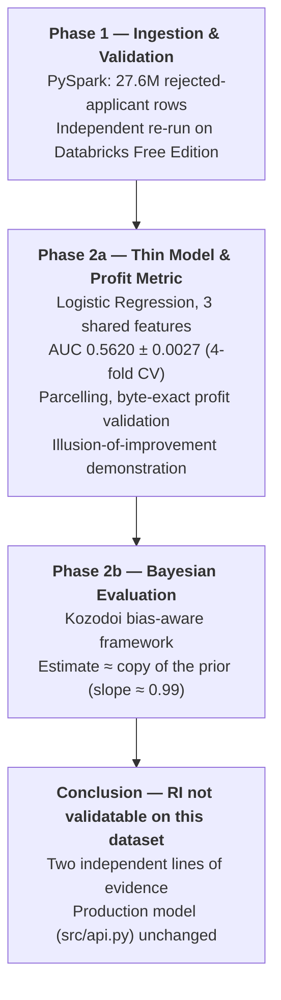

# Credit Default Prediction: Lending Club

[](https://github.com/MateusFPavan/credit-default-prediction-lendingclub/actions/workflows/docker.yml)
[](LICENSE)
[](https://www.python.org/)

Turning loan approvals into a profit decision: a credit-default model for real
peer-to-peer consumer loans, selected and evaluated by expected portfolio profit, not
accuracy.



## Headline Result

**On the 2015 held-out test set, the model rejects 3.8% of loan applications, avoiding
$32.2M in losses at a cost of $23.1M in forgone interest.** The result is a net gain of
$9.0M over an approve-everyone policy (95% CI $7.6M-$10.7M). Over a logistic-regression
baseline, the gain is +$6.3M. The total portfolio profit under the model's policy is
$242.23M. That figure already includes the $233.2M an approve-all policy would produce
with no modeling effort. The model's own attributable contribution is the $9.0M delta,
not the gross total.

**Key insight**: the model was chosen by expected profit, not accuracy, and that choice
mattered. The winning model ties a simpler logistic-regression baseline on AUC (0.68) but
wins decisively on profit. A standard accuracy/AUC contest would have called these two
models a coin flip and missed $6.3M of real, measurable value.

Rejecting just the riskiest 10% of applicants avoids ~21% of all defaults, twice as
effective as a random cut of the same size. Trained and evaluated on ~673K matured
36-month Lending Club loans (2007-2015, 14.8% default rate).

**Honest caveat, stated up front, not buried**: the model is least reliable in the
highest-risk, lowest-income segment. It was trained only on approved loans, so it cannot
score rejected applicants (a selection-bias limit). It is also not built for live lending
decisions as-is.

## Interactive Dashboard

**[▶ Explore the live dashboard](https://mateusfpavan.github.io/credit-default-prediction-lendingclub/)** — a scrollable walkthrough from the $9M headline through model discrimination, the profit decomposition, an interactive threshold slider (recomputes the confusion matrix and portfolio profit live on the 2015 test set), PSI stability with a raw-vs-clean sentinel-artifact contrast, and honest subgroup limitations.

[](https://mateusfpavan.github.io/credit-default-prediction-lendingclub/)

A Power BI version of the same analysis (`.pbix` + screenshots) lives in [`dashboard/`](dashboard/).

## Key Results

| Model | Test profit (2015) | 95% CI |
|---|---|---|
| Approve-all baseline | $233.2M | — |
| Logistic-regression baseline | $235.9M | — |
| **XGBoost, walk-forward-tuned (this model)** | **$242.2M** | **[$237.9M, $246.7M]** |

Rejecting the riskiest applicants captures defaults far faster than a random cut, and the
$9.0M net gain decomposes cleanly into avoided losses minus forgone interest. The number
is not inflated by an aggressive rejection policy (96.2% of applications are still
approved):





## Methodology, in Brief

- **Decision metric is expected portfolio profit**, not accuracy: `profit = interest on
  approved good loans − lost principal on approved bad loans`. A bad loan costs 2.67x
  what a good loan returns at the median. Treating every error equally, as accuracy does,
  misrepresents the actual economics of the decision.
- **Validation is temporal / walk-forward, never random**: train ≤2013, validate 2014,
  test 2015. Hyperparameters were selected across three expanding time windows: train
  through 2011 and validate on 2012, train through 2012 and validate on 2013, and train
  through 2013 and validate on 2014. Each window optimized profit, not a single
  validation year, and never AUC.
- **Missing data was resolved by mechanism**, not blanket imputation: informative
  absence (MNAR), staged bureau-data rollouts, and sparse-but-informative nulls each got
  a different, evidence-based treatment.
- **Leakage was screened on three fronts**: temporal (never shuffled), target
  (post-origination columns dropped, confirmed by univariate AUC), and identity
  (borrower ID is 100% null, so group-level splitting is not possible; this is stated as
  a limitation).
- **Two engineered features were tried and dropped** (redundant FICO average; a
  bankcard-utilization ratio undefined for 30% of borrowers). This is reported as a
  strength of the process, not something omitted.
- **Calibration was checked, and a recalibration attempt was rejected**: it improved a
  reliability metric but cost 42% of training data for no net profit gain.

Full methodology and every underlying number: [`docs/technical_report.md`](docs/technical_report.md).

## Serving & Monitoring

The model is served and monitored, not left as a notebook artifact. This is a reproducible,
CI-tested inference stack, not a hosted service under SLA — the selection-bias limit below
still governs what the scores may be used for.

- **Inference API** ([`src/api.py`](src/api.py)): a FastAPI service. `POST /score` takes a
  raw loan application, applies the *exact* training-time cleaning and encoding (reused via
  `src/scoring.py` → `src/cleaning.py` → `src/features.py`, never reimplemented), and returns
  a default probability plus an approve/reject decision at the 0.31 profit threshold.
  `GET /health` reports readiness. Out-of-range or missing input returns HTTP 422 rather
  than a silent wrong score, and `term` is restricted to 36 (the model is not valid for
  60-month loans).
- **Drift monitoring** ([`src/monitor.py`](src/monitor.py)): reuses the project's PSI engine
  (`src/psi.py`) to compare an incoming batch against the training baseline. It separates
  *genuine* drift (a real platform policy shift in `initial_list_status`, PSI ≈ 0.48) from
  *artifacts* (the definitional `issue_d` split cut), and refuses to score batches below a
  measured sample floor where PSI is just noise.
- **Containerized + CI**: a [`Dockerfile`](Dockerfile) serves the API from a lean,
  serving-only dependency set; a [GitHub Actions workflow](.github/workflows/docker.yml)
  builds the image and smoke-tests `/health`, a real `/score`, and the 422 path on every
  push.

Serving, monitoring, and the retraining trigger are documented in
[`docs/MODEL_CARD.md`](docs/MODEL_CARD.md) §10.

## Limitations

The model is not uniformly reliable, and that is reported directly rather than
smoothed over in an aggregate metric:



- **Weakest exactly where risk is highest**: AUC falls from 0.648 (grade A) to 0.585
  (grade G), and from 0.697 (highest income quartile) to 0.648 (lowest). That is the
  reverse of where a lender would most want precision.
- **Selection bias**: the model estimates P(default | approved), having never seen a
  rejected application. It cannot say how it would perform as a first-pass underwriting
  filter, only as a second layer over an already-approved loan book.
- **Not transferable to 60-month loans** without a dedicated scorecard. Applied without
  refitting, performance degrades severely, which is evidence that 36- and 60-month
  loans are structurally distinct risk populations.
- **Optimistic calibration, and the reason is measured**: observed default exceeds
  predicted in every decile (mean bias -0.0248). The cause is base-rate shift, not a
  broken estimator — the model's mean prediction (0.1240) reproduces the default rate of
  the split it was *trained* on (0.1243), while the 2015 test set defaulted at 0.1488.
  Recalibration was tested and rejected twice, by two different routes: retraining cost
  42% of training data for no net profit gain, and post-processing costs nothing but
  returns 0.6% of Brier. Neither is worth it, because the default rate follows the
  **credit cycle** rather than a trend — so there is no stable target to calibrate to.

Remaining next steps (deliberate, not gaps): a dedicated 60-month scorecard, automated
retraining execution with alerting, and monitoring against a real production batch.

Full disaggregated results, calibration analysis, and SHAP explainability:
[`docs/technical_report.md`](docs/technical_report.md) §8.

## Reject Inference: An Honest Investigation (v3)

The model above is trained only on approved loans, so it can only estimate
P(default | approved) — it has never seen a rejected application (see
Limitations). Reject inference (RI) is the standard technique that claims to
correct exactly this selection bias. This investigation asks, with rigor: is
RI actually validatable on this dataset? The answer is no, and the negative
result is the deliverable.

Full methodology, every number, and the chronological decision log:
[`docs/reject_inference_roadmap.md`](docs/reject_inference_roadmap.md).
Implementation: `notebooks/16` through `20`.


```mermaid
flowchart TD
    A["`**Phase 1 — Ingestion & Validation**
    PySpark: 27.6M rejected-applicant rows
    Independent re-run on Databricks Free Edition`"] --> B["`**Phase 2a — Thin Model & Profit Metric**
    Logistic Regression, 3 shared features
    AUC 0.5620 ± 0.0027 (4-fold CV)
    Parcelling, byte-exact profit validation
    Illusion-of-improvement demonstration`"]
    B --> C["`**Phase 2b — Bayesian Evaluation**
    Kozodoi bias-aware framework
    Estimate ≈ copy of the prior (slope ≈ 0.99)`"]
    C --> D["`**Conclusion — RI not validatable on this dataset**
    Two independent lines of evidence
    Production model (src/api.py) unchanged`"]
```

**What's new here** (this supersedes an earlier, less rigorous check that
reached the same directional conclusion):

- A **thin model** — Logistic Regression on the 3 features shared between
  approved and rejected applicants (`amount`, `dti`, `emp_length`) —
  evaluated out-of-sample via 4-fold CV: **AUC 0.5620 ± 0.0027**, barely
  above the no-skill line.
- **Parcelling**, implemented by hand (not simulated), scoring all 27.6M
  rejected applicants with the thin model and assigning a good/bad label
  proportional to expected bad rate, swept across `base_mult ∈ {1.0 – 3.0}`.
- The production profit metric (Kozodoi format), re-implemented
  independently and validated **byte-exact** against the already-published
  production result: **$242,230,710.89** at threshold 0.31 — identical to
  `docs/FACTS.md`. This confirms the new pipeline is correct without
  touching the served model.
- A **Bayesian bias-aware evaluation** (Phase 2b), testing whether the
  field's most sophisticated RI-evaluation method escapes the limitation
  found in Phase 2a.
- An **independent validation pass on Databricks Free Edition**, re-running
  the full PySpark ingestion pipeline end-to-end outside the local
  environment, confirming identical results.

**Two independent lines of evidence, same conclusion:**

1. **Phase 2a — direct impossibility.** The shared signal is weak (AUC
   0.56). There is no reject-outcome label anywhere in the dataset, so the
   field-standard Kickout/AUK evaluation metric is not just unimplemented
   but impossible here. There is also no true population default rate to
   check an inferred rate against — the metric that would normally protect
   against the "Illusion of Improvement" failure mode (Scarone & Baeza-Yates,
   ECML PKDD 2026) can't be computed. A direct demonstration confirms it:
   the post-RI training default rate inflates monotonically with the
   multiplier (14.2% → 42.3% as `base_mult` goes 1.0 → 3.0), and there is no
   way to tell, from this dataset, whether that inflation is bias correction
   or a new bias being manufactured.
2. **Phase 2b — even the best available method inherits the limitation.**
   Kozodoi's Bayesian bias-aware evaluation was tested to see if it escapes
   Phase 2a's limitation. It doesn't: the resulting estimate is nearly a
   copy of the prior fed into it (slope ≈ 0.99), because rejected applicants
   outnumber approved ones 159×, and the thin model's weak AUC can't push
   them out of the ranking — so ~99% of any evaluated sample ends up
   label-less, and the real labels are numerically swamped.

**What did not change:** `src/api.py`, `src/scoring.py`, `src/cleaning.py`,
the 0.31 threshold, the feature set, and the model's documented
selection-bias limitation are all untouched. This is a methodology chapter,
not a product change — reject inference was investigated and, with
evidence, not adopted.

## The Model

XGBoost wrapped for interface consistency alongside a scikit-learn `Pipeline` logistic
baseline. 79 named features, expanding to 90 columns after one-hot encoding. Serialized
with `joblib` at `models/xgb_final.joblib`. Hyperparameters, feature list, and a SHA256 of
the exact training data are recorded in `models/model_meta.json`. Reproducible end to end
via `python run_all.py` (~3 minutes, CPU only). Bit-exact determinism requires three
conditions: `random_state=42`, `n_jobs=1`, and training rows kept in their original
on-disk order (XGBoost's histogram algorithm is not row-order invariant).

Full specification: [`docs/MODEL_CARD.md`](docs/MODEL_CARD.md).

## Reproducing This Project

```bash
git clone https://github.com/MateusFPavan/credit-default-prediction-lendingclub.git
cd credit-default-prediction-lendingclub
python -m venv .venv
source .venv/bin/activate          # Windows: .venv\Scripts\Activate.ps1
pip install -r requirements.txt
# register the Jupyter kernel used by the pipeline notebooks — see docs/SETUP.md
```

Download the raw dataset manually (Kaggle `wordsforthewise/lending-club`, CC0 license,
requires a free Kaggle account and is not auto-downloaded) and place it at
`data/raw/accepted_2007_to_2018Q4.csv`. Then:

```bash
python run_all.py
```

This reproduces the final model and its exact test result in about 3 minutes on CPU: raw
CSV becomes a cleaned dataset, then a temporal split, then features, then a trained
model, then a verified profit figure. **It deliberately does not re-run the
model-*selection* experiments** (baseline comparison, walk-forward hyperparameter tuning,
bootstrap validation, in `notebooks/06` through `11`): those take hours and are not
needed to reproduce the delivered model. They are fully documented, not hidden. See
`docs/FACTS.md` and the notebooks themselves.

To serve the model behind the API (optional):

```bash
pip install -r requirements-api.txt
uvicorn src.api:app --reload          # API at http://localhost:8000, contract at /docs
# or, containerized:
docker build -t credit-default-api . && docker run -p 8000:8000 credit-default-api
```

Full setup and troubleshooting: [`docs/SETUP.md`](docs/SETUP.md).

## Repository Structure

```
data/            raw CSV (gitignored) and processed parquets (gitignored, sample versioned)
notebooks/       01-15 working notebooks (full process) + 1.0-7.0 narrated notebooks (presentation)
                 + 16-20 reject-inference investigation (PySpark/Databricks ingestion,
                 thin model, profit metric, illusion demonstration, Bayesian evaluation)
src/             data · features · economics · models · psi · scoring · cleaning · api · monitor · run/verify scripts
models/          xgb_final.joblib (versioned) + model_meta.json; logistic_baseline.joblib (gitignored)
reports/figures/ business-impact figures
reports/reject/  reject-inference data artifacts (coverage, comparison, provenance manifest)
docs/            technical report, data card, model card, setup guide, facts sheet, reject-inference roadmap
dashboard/       Power BI (.pbix) + theme + screenshots; interactive web dashboard in docs/index.html
references/      one-page recruiter case studies (EN and pt-BR)
Dockerfile       containerized inference API
.github/         GitHub Actions CI (build + smoke-test the container)
```

## Documentation Index

| Document | Purpose |
|---|---|
| [`docs/technical_report.md`](docs/technical_report.md) | Full methodology and results |
| [`docs/FACTS.md`](docs/FACTS.md) | Canonical, verified facts sheet, the single source of truth for every number |
| [`docs/DATA_CARD.md`](docs/DATA_CARD.md) | Dataset datasheet (provenance, license, missing-data mechanisms) |
| [`docs/MODEL_CARD.md`](docs/MODEL_CARD.md) | Model specification, training procedure, evaluation, serving |
| [`docs/reject_inference_roadmap.md`](docs/reject_inference_roadmap.md) | Reject-inference investigation (v3): full methodology, decisions, and results |
| [`docs/SETUP.md`](docs/SETUP.md) | Environment setup and reproduction, step by step |
| [`CHANGELOG.md`](CHANGELOG.md) | Versioned change history (Keep a Changelog / SemVer) |
| [`references/one_pager.md`](references/one_pager.md) | One-page recruiter case study (EN) |
| [`references/one_pager.pt-br.md`](references/one_pager.pt-br.md) | One-page recruiter case study (pt-BR) |
| `notebooks/` | Full working process (`01`-`15`) and a narrated walkthrough (`1.0`-`7.0`) |

## Stack

Python · pandas · scikit-learn · XGBoost · SHAP · matplotlib · FastAPI · Docker · GitHub Actions · PySpark · Databricks · DuckDB

## License & Contact

MIT. See [`LICENSE`](LICENSE). **Author**: Mateus Fardin Pavan. **Repository**:
<https://github.com/MateusFPavan/credit-default-prediction-lendingclub>. **Contact**:
<https://www.linkedin.com/in/mateus-fardin-pavan/>.
