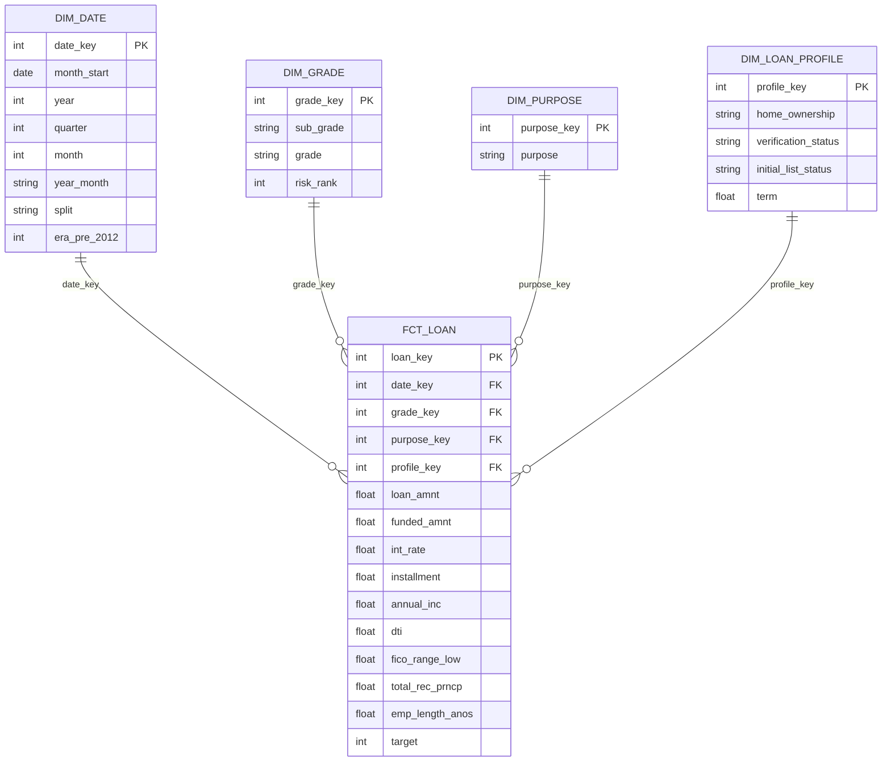

# Dimensional Model

A Kimball-style star schema over the cleaned analytical population, built by
[`src/build_marts.py`](../src/build_marts.py) and consumed by
[`dashboard/credit_risk_dashboard.pbix`](../dashboard/credit_risk_dashboard.pbix).

## Why this exists

The dashboard originally shipped **nine flat tables** — `facts_metrics`,
`facts_confusion`, `facts_confusion_long`, `facts_financial`, `facts_subgroups`,
`facts_waterfall`, `psi_quarterly`, `psi_splits_clean`, `psi_splits_raw` — with **no
relationships between them**. Despite the `facts_` prefix, none was a fact table in the
dimensional sense: a fact table carries foreign keys into dimensions, and there were no
dimensions to key into.

Those tables are exports of numbers that were already computed. They answer the questions
someone decided in advance, and they cannot answer anything else. *"What is the default
rate for grade D loans issued in 2013?"* was unanswerable in the tool, because the model
held neither grades nor vintages — only finished rows.

This model publishes the grain instead, so the questions get asked in the tool rather than
in Python.

## Grain

> **One row in `fct_loan` is one loan contract from the cleaned analytical population.**

673,314 rows. Every measure on the fact is additive across every dimension, which is what
makes the grain worth stating first: an ambiguous grain is the defect that a star schema
exists to prevent.

## Schema



| Table | Rows | Grain |
|---|---|---|
| `fct_loan` | 673,314 | one loan contract |
| `dim_date` | 103 | one issue month (2007-06 → 2015-12) |
| `dim_grade` | 35 | one sub-grade (A1 → G5) |
| `dim_purpose` | 11 | one stated loan purpose |
| `dim_loan_profile` | 46 | one observed combination of four low-cardinality flags |

`target` is the binary outcome (1 = charged off). Averaging it over any dimension gives
that slice's default rate, which is the single most useful thing the old flat tables could
not do.

## Design decisions

These are the choices worth defending, and the reasoning matters more than the result.

### The split is an attribute of `dim_date`, not a dimension

This project's train/validation/test split is **temporal** — train is 2007-06 → 2013-12
(79 months), validation is 2014 (12 months), test is 2015 (12 months). Split membership is
therefore a property of the month itself, not an independent axis.

Modelling it as its own dimension would imply a loan could have belonged to a different
split without changing its issue date. Here that is false by construction, and a schema
should not offer a slice that cannot exist.

### `dim_loan_profile` is a junk dimension

`home_ownership` (4 values), `verification_status` (3), `initial_list_status` (2) and
`term` (2) are low-cardinality flags with no attributes of their own. Four separate
two-to-four-row dimension tables would be ceremony rather than modelling, and would put
four extra joins on every query for no gain.

The standard answer is one **junk dimension** holding the observed combinations:
**46 of the 48 possible** occur in the data. The two that never occur are both
`home_ownership = other` with a `w`-listed 60-month term — storing only what was observed
keeps the dimension honest about the data rather than about the Cartesian product.

### `dim_grade` is a hierarchy inside one dimension, not a snowflake

The grain is `sub_grade` (35 rows) with `grade` (7 values) carried as an attribute. This is
deliberately **not** snowflaked into `dim_grade → dim_sub_grade`: normalising a 35-row
dimension saves no meaningful storage and costs a join on every query that wants the grade
roll-up. Because `sub_grade` sorts A1 → G5, the surrogate key doubles as `risk_rank`.

### There is no geographic dimension

`addr_state` does not survive into the cleaned analytical population. A `dim_state` built
from anything else available here would be fabricated, and a fabricated dimension is worse
than an absent one.

### The fact carries no model predictions — yet

Adding predicted PD is the obvious next step and it is deliberately not in v1. The model is
trained on 2007–2013; predictions for those vintages are **in-sample** and predictions for
2015 are **out-of-sample**, and the two are not comparable. Putting both in one column
would create a dashboard that quietly rewards the model for memorising its training data.

The plan is a `pd_predicted` measure populated **only** where `dim_date.split = 'test'`,
with the null elsewhere being the honest answer rather than a gap. Profit contribution per
contract follows the same rule.

### A note on `era_pre_2012`

`dim_date` carries `era_pre_2012` as a time attribute, and it is genuinely useful for
slicing here. It is worth recording that the **same flag, used as a model feature, is never
split on by the fitted model** — zero splits out of 90 columns (the other unused column is
`num_tl_120dpd_2m_missing`).

That is not a contradiction; it is the same column doing well in the role that suits it. A
binary era flag cannot represent the base rate's actual behaviour, which **cycles** rather
than steps (17.9% in 2007 → 9.9% in 2010 → 12.3% in 2013 — see `docs/MODEL_CARD.md` §10).
As a descriptive attribute for a human slicing a dashboard, a coarse era split is exactly
right.

## Verification

`src/build_marts.py` writes nothing unless all of the following hold, and it says so line
by line:

| Check | Result |
|---|---|
| `date_key` orphans | 0 |
| `grade_key` orphans | 0 |
| `purpose_key` orphans | 0 |
| `profile_key` orphans | 0 |
| Fact rows == source rows | 673,314 == 673,314 |
| `loan_amnt` reconciliation | $8,814,551,350.00 vs $8,814,551,350.00, difference $0.00 |

The row-count check is what catches a fan-out — the failure mode where a dimension is not
unique on its business key and a `merge` silently multiplies the fact.

## Rebuilding

```bash
python -m src.build_marts
```

The four dimension CSVs are versioned in this repository (195 rows total): they are small,
they are readable in a diff, and they document the model without requiring the data.
`fct_loan.parquet` is not versioned, for the same reason as the other processed parquets.

## Source

`data/processed/loans_clean.parquet` — the cleaned analytical population, 673,314 rows.
That is the analytical population of 673,553 minus 5 rows with impossible `dti` and 234
joint-application rows, both documented in [`docs/FACTS.md`](FACTS.md) §2.
